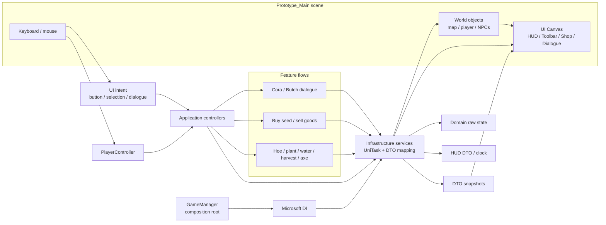
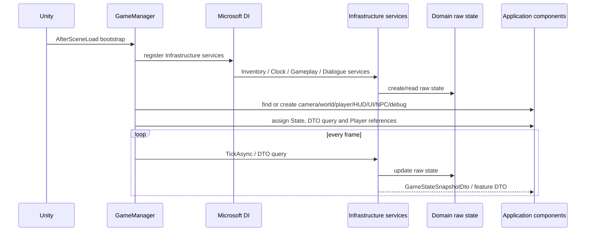
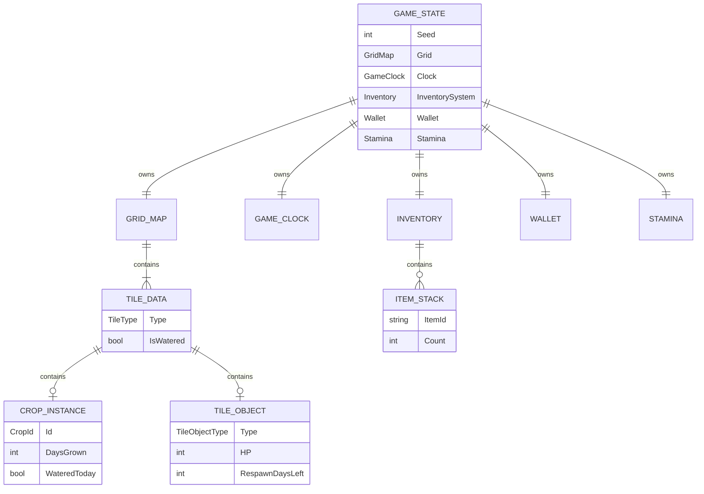
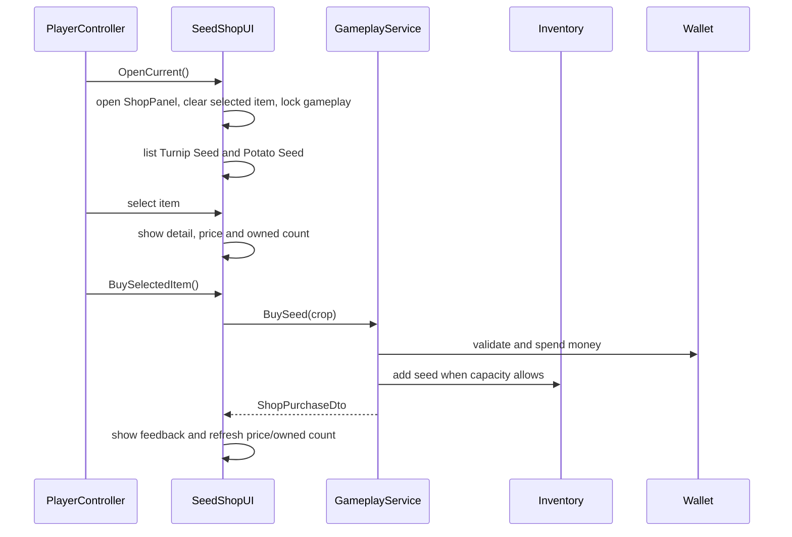

# Architecture flow — Farming Prototype

This document describes the current implementation in the `dev` branch. It is
not a target architecture: the flow below is based on the classes and scene
that actually exist in the project.

## 0. High-level runtime flow

The following diagram shows how input travels through the current Unity scene,
application components and Infrastructure services before the UI is refreshed.



Runtime ownership is intentionally explicit: the scene owns layout and art
references, Application owns input-to-view coordination, Infrastructure owns
behavior and DTO conversion, and Domain owns raw state/data contracts. UI never
becomes the source of truth for inventory, wallet, crops or time.

## 1. Current layer map

```text
Unity scene / Unity lifecycle
        │
        ▼
Prototype.Application
  Inventory/         InventoryService bindings, InventorySlotData,
                     ToolbarCanvasUI, InventoryScreenUI
  Components/Mapping GenericMapper for raw-to-application projections
  Gameplay/          IGameplayService and action/shop DTOs
  Dialogue/          IDialogueService and DialogueDto
  State/             IClockService, IGameWorldService, state/time DTOs
  GameManager          composition root and runtime bootstrap
  PlayerController     input, movement, active-slot actions
  WorldView            world rendering
  HUD                 HUD rendering
  SeedShopUI           UGUI shop and shop actions
  NpcDialogueController NPC interaction and dialogue presentation
  DebugPanel           debug-only controls
        │ calls Infrastructure only
        ▼
Prototype.Infrastructure
  InventoryService / UniTask implementations
  ClockService / GameplayService / DialogueService
  GameStateApplicationService / repository adapters
  ArtCatalog / PlaceholderArt / SessionLogger
        │
        │ reads and mutates raw models through ports
        ▼
Prototype.Domain
  Inventory/    Entities/Inventory, Services/IInventoryService and
                IInventoryReader, ValueObjects/ItemStack
  Entities/     GameState, GridMap, TileData, CropInstance,
                Wallet, Stamina, GameClock, NPC state
  ValueObjects/ GridCoord, tool result/value types
  Policies/      BalanceConfig, crop/tree definitions
  Ports/         IGameStateRepository
```

Inventory is intentionally a Domain feature folder. `IInventoryService` is a
Domain port whose operations return UniTask directly (`Add`, `Remove`, `Count`,
etc.); there are no duplicate `*Async` methods. The implementation is
`Infrastructure/Inventory/InventoryService`. The same Infrastructure class
exposes destination-typed projections through its generic mapper usage and
returns `InventorySlotData[]` directly to the inventory UI. There is no
Application inventory-query interface: the composition root injects the
concrete Infrastructure service where a projection is needed.

`Presentation` has been merged into `Application`. Feature actions call
Infrastructure services and consume their DTOs. Domain contains no DTOs. The
world renderer still receives the raw runtime aggregate through the composition
root for map/collision/sprite queries; new state mutation must go through
Infrastructure. There is no `Farm.Prototype.*` namespace in the current source.

The physical folders under `Assets/_Prototype/Scripts/Application/` are only
for navigation (`UI`, `Player`, `NPC`, `World`, `Debug`, etc.). They are not
separate architectural layers.

## 2. Composition and startup flow



`GameManager` is the actual composition root. It creates the domain state,
builds the Microsoft DI service provider, then wires the MonoBehaviours. The
shared time/read boundary is `GameStateApplicationService`; feature-specific
controllers call Infrastructure services; Domain is not exposed to UI.

Infrastructure owns behavior over the raw entities and implements Domain ports
such as `IGameStateRepository`; the in-memory adapter currently creates and
holds the aggregate, while a file/cloud adapter can replace it later. DTOs are
created in Infrastructure, never in Domain.

Important bootstrap behavior:

- `Prototype_Main.unity` contains the main camera and authored UI canvas roots.
- `ToolbarCanvasUI` is found in the scene and bound to `Player` and
  concrete `InventoryService`; the toolbar is not created by `GameManager`.
- `GameStateApplicationService` maps mutable domain state into
  `GameStateSnapshotDto`. HUD time rendering consumes `IGameStateQuery` and
  does not read `GameClock` or create fallback IMGUI controls.
- Missing runtime components such as `PlayerController`, `HUD`,
  `InventoryScreenUI`, `SeedShopUI`, NPC and debug components are created by
  `GameManager` when absent.
- World and scenery are created/bound at runtime from `GameState` and
  `ArtCatalog`.

## 3. Domain state ownership



`GameState` is the raw state boundary used internally by Infrastructure. DTOs
are created only at the Infrastructure boundary for Application/UI consumers.

## 4. Player action flow

```text
Keyboard / mouse
      ↓
PlayerController.Update()
      ↓
read active Inventory slot
      ↓
resolve item to action
      ├─ Hoe / WateringCan / Harvest / Axe → GameplayService.UseTool()
      ├─ Turnip/Potato seed                → GameplayService.PlantSpecific()
      └─ interaction tile                  → SeedShopUI.OpenCurrent()
      ↓
Infrastructure validates tile, stamina, inventory and object state
      ↓
Infrastructure mutates Domain raw state
      ↓
Infrastructure returns ToolActionDto / feature DTO
      ↓
PlayerController and UI components redraw
```

Tree collision and the cursor use the same `GridMap.IsOccupied()` query. A
felled tree remains an occupied tile until its respawn countdown completes.

## 5. Seed shop flow



`SeedShopUI` is a UGUI component. It currently ensures the shop controls under
the scene-authored `ShopPanel` at runtime (`TitleText`, `ItemListPanel`,
`DetailPanel`, `PurchasePanel`, `BuyButton`, and `CloseButton`). Its public
Inspector-callable entry points are:

- `ListItems`, `ListItem(string)`
- `ListTurnipSeed`, `ListPotatoSeed`
- `ShowItemDetail(string)`, `ShowTurnipSeedDetail`, `ShowPotatoSeedDetail`
- `BuySelectedItem`, `BuyTurnipItem`, `BuyPotatoItem`

The Infrastructure transaction is atomic with respect to insufficient funds
and full inventory: it validates before changing Domain raw state.

## 6. Toolbar, HUD and inventory flow

```text
Infrastructure InventoryService
        │
        ├─ GameStateApplicationService → GameStateSnapshotDto
        │                              ├─ GameClockDto → HUD
        │                              └─ GenericMapper → InventorySlotData[]
        │                                  → ToolbarCanvasUI
        │
        ├─ GenericMapper → InventorySlotData[] → InventoryScreenUI / ToolbarCanvasUI
        │
        └─ active slot → PlayerController action resolution
```

The toolbar background, slot objects, anchors and responsive canvas are
scene-authored. Runtime code updates item images, counts and selection state.
`InventoryService` implements the Domain `IInventoryService` port and exposes
the concrete read projection used by the Application inventory UI. DI registers
the same instance for both the concrete Infrastructure service and the Domain
port; the Domain inventory remains the source of truth.

## 7. NPC dialogue flow

```text
Player near Cora/Butch
        ↓ E
NpcDialogueController finds nearby NpcDefinition
        ↓
DialogueState opens at line 0
        ↓ E / Enter / Space
advance line or close at final line
        ↓ Esc
close early and unlock gameplay
```

NPC definitions and dialogue state live in `Prototype.Domain`. The controller
owns proximity, input and presentation. There are no quests, branching choices,
relationship values or schedules in the current implementation.

## 8. Art and infrastructure flow

```text
Source sprites
      ↓ Editor CIArt / ArtCatalog
Resources/ArtCatalog.asset
      ↓
PlaceholderArt
      ├─ WorldView / scenery SpriteRenderers
      ├─ PlayerController player art
      └─ Toolbar/UI item icons

GameState / actions
      ↓
SessionLogger → local Artifacts/session_<seed>.csv
```

`ArtCatalog` and `SessionLogger` are currently in the `Prototype.Application`
namespace even though their folders identify them as infrastructure adapters.
They are not domain rules.

## 9. Testing and current boundary

- EditMode tests exercise domain rules, economy, crops, tools, clock, NPC state
  and DTO/query behavior without a scene.
- PlayMode tests boot the real scene and cover component wiring, collision,
  player-facing behavior and UI smoke paths.
- `HeadlessSim` runs the same `GameState`/domain rules for economy checks.
- Unity CLI is used for compile/test/build validation.

The current implementation uses a pragmatic MVC-like Application layer: UI
MonoBehaviours own input/presentation coordination, while feature behavior is
delegated to Infrastructure services. Some world-rendering components still
receive the aggregate through the composition root because they need map,
collision and sprite data. New state mutation must remain behind an
Infrastructure service and new DTOs must remain outside Domain.
