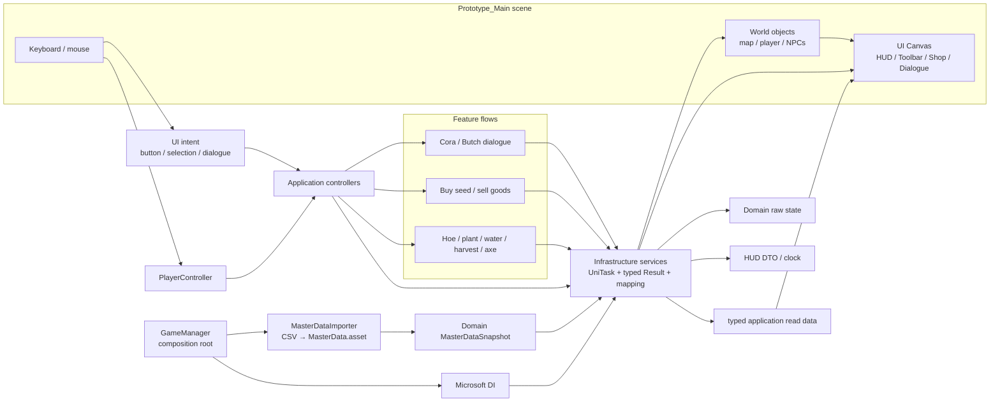
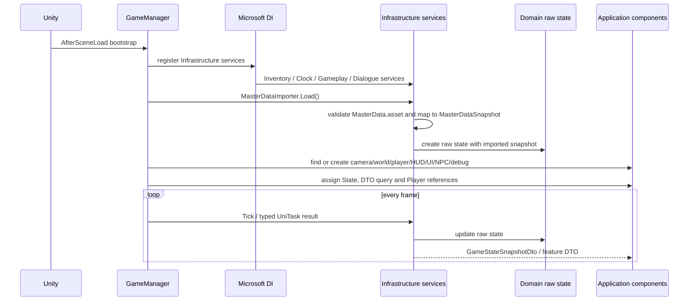
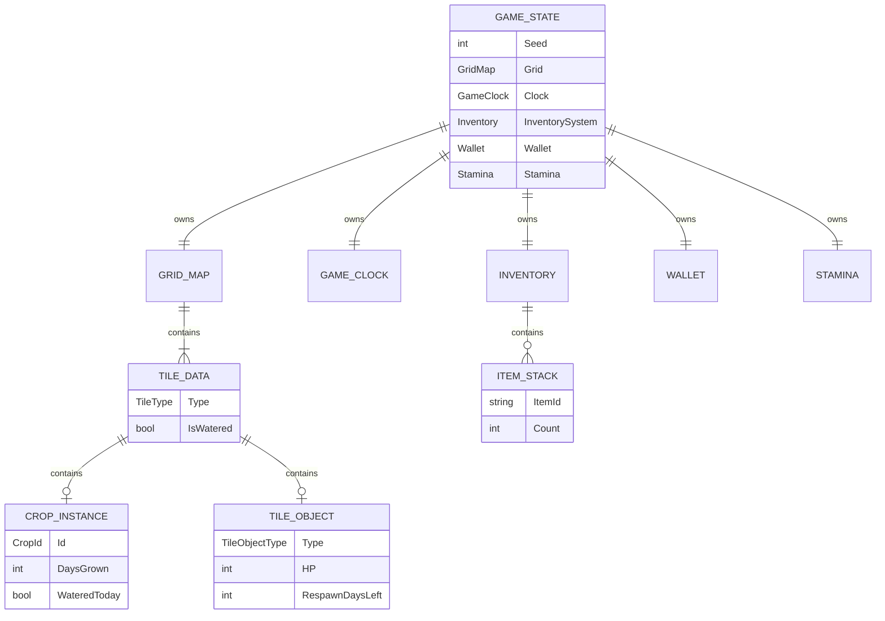
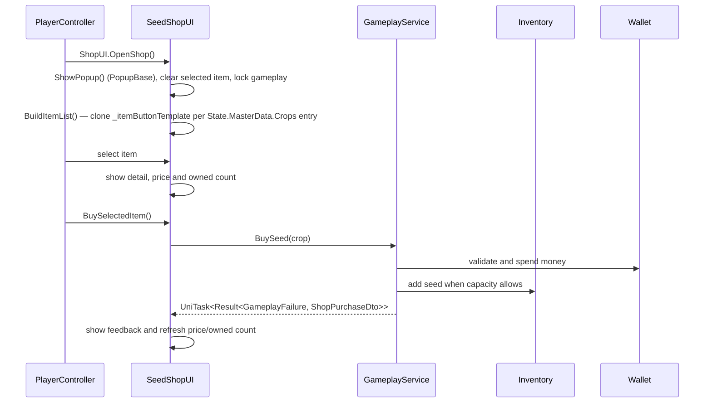

# Architecture flow — Farming Prototype

This document describes the current implementation on `main` (`dev` currently
points at the same commit). It is not a target architecture: the flow below
is based on the classes and scene that actually exist in the project.

## 0. High-level runtime flow

The following diagram shows how input travels through the current Unity scene,
application components and Infrastructure services before the UI is refreshed.



Runtime ownership is intentionally explicit: the scene owns layout and art
references, Application owns input-to-view coordination, Infrastructure owns
behavior, results and data conversion, and Domain owns raw state/data
contracts. UI never becomes the source of truth for inventory, wallet, crops
or time.

## 1. Current layer map

```text
Unity scene / Unity lifecycle
        │
        ▼
Prototype.Application
  Inventory/         InventoryService bindings, InventorySlotData,
                     ToolbarCanvasUI, InventoryScreenUI, InventorySlotView,
                     ItemDetailPopup
  Components/Mapping GenericMapper for raw-to-application projections
  Gameplay/          IGameplayService and action/shop DTOs
  Dialogue/          IDialogueService and DialogueDto
  State/             IClockService, IGameWorldService, state/time DTOs
  UI/Popup/          PopupBase, PopupParent — shared popup open/close,
                     animation and stacking used by every scene popup
  UI/                HUD, SeedShopUI, ResponsiveUILayout
  GameManager          composition root and runtime bootstrap
  PlayerController     input, movement, active-slot actions
  WorldView            world rendering
  HUD                 HUD rendering
  SeedShopUI           UGUI shop popup (PopupBase) and shop actions
  NpcDialogueController NPC interaction and dialogue presentation
  DebugPanel           debug-only controls
        │ calls Infrastructure only
        ▼
Prototype.Infrastructure
  InventoryService / UniTask + typed Result implementations
  ClockService / GameplayService / DialogueService
  MasterDataCsvImporter / MasterDataAsset (+ MasterDataImporter) / validation + mapping
  GameStateApplicationService / repository adapters
  ArtCatalog / PlaceholderArt / SessionLogger
        │
        │ reads and mutates raw models through ports
        ▼
Prototype.Domain
  Inventory/     Entities/Inventory, Services/IInventoryService +
                 InventoryFailure, ValueObjects/ItemStack
  Contracts/     Result, FailureCode, GameplayFailure, ShopResults, ToolResult
  Dialogue/Services  DialogueFailure
  MasterData/    MasterDataFailure, MasterDataSnapshot
  State/Services ClockFailure, RepositoryFailure, StateFailure
  World/Services WorldFailure
  Entities/      GameState, GridMap, TileData, CropInstance,
                 Wallet, Stamina, GameClock, NpcDefinition, DialogueState
  ValueObjects/  GridCoord, ToolType
  Policies/      BalanceConfig, CropDefinition, TreeDefinition
  Ports/         IGameStateRepository
```

Inventory is intentionally a Domain feature folder, and the same feature-folder
pattern now covers the rest of Domain: each feature (`Dialogue`, `MasterData`,
`State`, `World`) keeps its own `Services/<Feature>Failure` type next to the
shared `Contracts/` result plumbing (`Result<TFailure, TValue>`, `FailureCode`,
`GameplayFailure`, `ShopResults`, `ToolResult`), instead of one flat
`Entities/`+`Policies/` bucket. `IInventoryService` is a Domain port whose
operations return UniTask directly (`Add`, `Remove`, `Count`, etc.); there are
no duplicate `*Async` methods. The implementation is
`Infrastructure/Inventory/InventoryService`. The same Infrastructure class
exposes destination-typed projections through its generic mapper usage and
returns `InventorySlotData[]` directly to the inventory UI. There is no
Application inventory-query interface: the composition root injects the
concrete Infrastructure service where a projection is needed. Infrastructure
uses the same result contract for gameplay and shop operations: expected
failures return a `FailureCode`, while unexpected exceptions become
`SystemError` after logging.

`Presentation` has been merged into `Application`. Feature actions call
Infrastructure services and consume their DTOs. Domain contains no DTOs. The
world renderer still receives the raw runtime aggregate through the composition
root for map/collision/sprite queries; new state mutation must go through
Infrastructure. There is no `Farm.Prototype.*` namespace in the current source.

Master Data is the content boundary. CSV files under
`Assets/_Prototype/MasterData/CSV/` are the reviewable source. The Infrastructure
`MasterDataCsvImporter` parses and validates them, resolves item art through the
Editor adapter, and writes `MasterDataAsset` in `Resources`. Runtime
`MasterDataImporter` then validates that ScriptableObject and maps it to the
immutable `Prototype.Domain.MasterDataSnapshot`. `GameManager` imports the
snapshot before calling `IGameStateRepository.Load(...)`. The Domain aggregate
receives only that snapshot and never reads CSV, `Resources`, `ScriptableObject`
or `AssetDatabase`. Infrastructure services then use the snapshot for gameplay
rules, while Application uses the resulting state/DTOs and ScriptableObject art
references for UI.

The physical folders under `Assets/_Prototype/Scripts/Application/` are only
for navigation (`UI`, `Player`, `NPC`, `World`, `Debug`, etc.). They are not
separate architectural layers.

Application UI components have moved from resolving scene children at
runtime (`transform.Find("Panel/Child")`) toward serialized `[SerializeField]`
references assigned in the Inspector — `HUD`, `WorldView`, `NpcDialogueController`
and every `PopupBase` popup now follow this pattern, logging a warning instead
of silently failing when a reference is unassigned. `AuthorUiHierarchy` is the
one-shot editor command that built the corresponding hierarchy into
`Prototype_Main.unity`.

## 2. Composition and startup flow



`GameManager` is the actual composition root. It creates the domain state,
builds the Microsoft DI service provider, then wires the MonoBehaviours. The
shared time/read boundary is `GameStateApplicationService`; feature-specific
controllers call Infrastructure services; Domain is not exposed to UI.

Infrastructure owns behavior over the raw entities and implements Domain ports
such as `IGameStateRepository`; the in-memory adapter currently creates and
holds the aggregate, while a file/cloud adapter can replace it later. DTOs are
created in Infrastructure, never in Domain.

Important bootstrap behavior:

- `Prototype_Main.unity` contains the main camera and authored UI canvas roots.
- `MasterData.asset` (generated from CSV) is loaded and validated before
  `GameState` is constructed;
  an invalid asset returns a typed `MasterDataFailure` and prevents a partially
  configured session from starting.
- `ToolbarCanvasUI` is found in the scene and bound to `Player` and
  concrete `InventoryService`; the toolbar is not created by `GameManager`.
- `GameStateApplicationService` maps mutable domain state into
  `GameStateSnapshotDto`. HUD time rendering consumes `IGameStateQuery` and
  does not read `GameClock` or create fallback IMGUI controls.
- Missing runtime components such as `PlayerController`, `HUD`,
  `InventoryScreenUI`, `SeedShopUI`, NPC and debug components are created by
  `GameManager` when absent.
- World and scenery are created/bound at runtime from `GameState` and
  `ArtCatalog`.

## 3. Domain state ownership



`GameState` is the raw state boundary used internally by Infrastructure. DTOs
are created only at the Infrastructure boundary for Application/UI consumers.

## 4. Player action flow

```text
Keyboard / mouse
      ↓
PlayerController.Update()
      ↓
read active Inventory slot
      ↓
resolve item to action
      ├─ Hoe / WateringCan / Harvest / Axe → GameplayService.UseTool()
      ├─ Turnip/Potato seed                → GameplayService.PlantSpecific()
      └─ interaction tile                  → Player.ShopUI?.OpenShop()
      ↓
Infrastructure validates tile, stamina, inventory and object state
      ↓
Infrastructure mutates Domain raw state
      ↓
Infrastructure returns ToolActionDto / feature DTO
      ↓
PlayerController and UI components redraw
```

Tree collision and the cursor use the same `GridMap.IsOccupied()` query. A
felled tree remains an occupied tile until its respawn countdown completes.

## 5. Seed shop flow



`SeedShopUI` is a UGUI component and derives from `PopupBase` (see §6a),
sharing the same `PopupParent` stack as `InventoryScreenUI` and
`ItemDetailPopup`. Its `SeedShopPopup` hierarchy (`TitleText`, `ItemListUI`,
`ItemDetailUI`, `PurchaseUI`, `CloseButton`) is fully scene-authored and
wired through serialized `[SerializeField]` references — GameManager/
SeedShopUI never create or "ensure" these controls at runtime; the one-shot
editor command `AuthorUiHierarchy` (menu-driven, under
`Assets/_Prototype/Editor/`) is what built that hierarchy into
`Prototype_Main.unity`. `SeedShopPopup` itself is a flat white/near-white
UGUI panel (`Image.type = Simple`, no sprite) — every sub-panel used to share
a one-off NPC-dialogue composite sprite via `Image.type = Sliced`, which had
no 9-slice border to slice by and rendered nested, distorted copies of the
whole picture at every panel's own size; the flat-fill panels avoid that
entirely and keep text legible.

The item list is Master-Data-driven, not hardcoded per crop: only one
`_itemButtonTemplate` button is authored (inactive by default). At runtime,
`BuildItemList()` clones it once per entry in `State.MasterData.Crops`, sets
its label from `SeedItemId`/`SeedPrice`, and wires its `onClick` to
`Select(crop.Id)` — adding a row to Master Data is enough to add an entry to
the shop, no per-crop button or per-crop method. `ShowItemDetail(string)`
looks up the matching crop by scanning `State.MasterData.Crops` for a
`SeedItemId` match, the same generic way, instead of per-crop `if` branches.

`OpenShop()`/`CloseShop()` call the inherited `ShowPopup()`/`HidePopup()`,
which animate the popup's scale (via `iTween` if present, otherwise a
fallback coroutine tween) and lock/unlock player input through
`Player.SetGameplayLocked`. Its public Inspector-callable entry points are:

- `ListItems`, `ListItem(string)`
- `ShowItemDetail(string)`
- `BuySelectedItem`, `BuyTurnipItem`, `BuyPotatoItem` (direct compat entry
  points kept for existing callers/tests; not part of the generated list)

`SeedShopUI` has no public static `Instance` and no static `IsOpen`/
`PointerOverUI` — those are inherited/declared as ordinary instance members
from `PopupBase`. Its Domain/Infrastructure dependency fields
(`State`, `MasterDataAsset`, `GameplayService`, `InventoryService`, `Player`)
are `internal`, assignable only by `GameManager` (composition root, same
assembly). Other components that need to query the shop
(`PlayerController`, `InventoryScreenUI`, `DebugPanel`) hold an explicit
`internal SeedShopUI ShopUI` field wired by `GameManager` in
`SetupSeedShop()`/`SetupDebug()`, instead of reaching for a singleton. This
composition-root-wires-references pattern (rather than a static `Instance`
per UI script) is now the convention for every UI component except
`GameManager` itself, which is the one script important enough to justify
its own static `Instance` (used by `GameManager.SpawnFeedback`).

The Infrastructure transaction is atomic with respect to insufficient funds
and full inventory: it validates before changing Domain raw state.

## 6. Toolbar, HUD and inventory flow

```text
Infrastructure InventoryService
        │
        ├─ GameStateApplicationService → GameStateSnapshotDto
        │                              ├─ GameClockDto → HUD
        │                              └─ GenericMapper → InventorySlotData[]
        │                                  → ToolbarCanvasUI
        │
        ├─ GenericMapper → InventorySlotData[] → InventoryScreenUI / ToolbarCanvasUI
        │
        └─ active slot → PlayerController action resolution
```

The toolbar background, slot objects, anchors and responsive canvas are
scene-authored. Runtime code updates item images, counts and selection state.
`InventoryService` implements the Domain `IInventoryService` port and exposes
the concrete read projection used by the Application inventory UI. DI registers
the same instance for both the concrete Infrastructure service and the Domain
port; the Domain inventory remains the source of truth. Inventory mutations
return `Result<InventoryFailure, TValue>`, so callers can distinguish `InventoryFull`,
`InsufficientInventory`, `LockedSlot`, `NotInitialized` and `SystemError`
without parsing UI text.

`InventoryScreenUI` (the `I` popup) is a `PopupBase` controller that resolves
its scene-authored panel, opens/closes it, and locks gameplay input while
open (`Player.SetGameplayLocked`) — the 48-slot grid (12x4, matching the
toolbar's pixel-perfect scale) is scene-authored by
`AuthorUiHierarchy.BuildInventoryGrid()`, not runtime-built. Each cell is an
`InventorySlotView` (`RequireComponent(Image)`): a dumb view + pointer/drag
surface whose `SlotIndex` is assigned once by the authoring script and
matches the Domain `Inventory.Slots` index it represents.
`InventoryScreenUI` pushes `SetContent(itemId, count, icon, tint, hideIcon)`
into every slot each frame while the popup is open, and owns the actual
`InventoryService.Swap` call, the shared drag-ghost image, and hover/drop
handling — `InventorySlotView` only forwards pointer events
(`IBeginDragHandler`/`IDragHandler`/`IEndDragHandler`/`IDropHandler`) back to
it. `ToolbarCanvasUI` and `InventoryScreenUI` both call
`ItemDetailPopup.Hide(this)` when a pointer leaves a slot so a stale tooltip
never lingers; a slot's pointer-enter calls `ItemDetailPopup.Show(itemId,
count, mousePosition, source)` to show that item's hover tooltip (see §6a).

### 6a. Popup framework (PopupBase / PopupParent)

```text
Application/UI/Popup/
  PopupBase     open/close lifecycle, scale animation (iTween ▸ fallback
                coroutine tween), OnPopupShown/OnPopupHidden hooks
  PopupParent   per-canvas popup stack; Show() brings a popup to front,
                HideAll() closes every registered popup

extend PopupBase, share one PopupParent:
  InventoryScreenUI, SeedShopUI, NpcDialogueController, ItemDetailPopup
```

Every scene popup — the inventory panel, the seed shop panel, the NPC
dialogue panel and the item-detail hover tooltip (`ItemDetailPopup`) —
derives from `PopupBase` and
registers with the scene's `PopupParent`. `PopupParent.Show()` re-parents the
popup to the last sibling so the most recently opened popup renders on top,
and `HideAll()` gives one place to close every open popup (used by input
locks and screen transitions). `ItemDetailPopup` additionally positions
itself next to the cursor, clamped to stay on-screen, and resolves its
content (`DisplayName`, `Description`, icon) from `GameManager.Instance.MasterData`.
This popup hierarchy was authored into `Prototype_Main.unity` by the one-shot
editor command `AuthorUiHierarchy` (`Assets/_Prototype/Editor/AuthorUiHierarchy.cs`);
it is not rebuilt at runtime.

## 7. NPC dialogue flow

```text
Player near Cora/Butch
        ↓ E
NpcDialogueController finds nearby NpcDefinition
        ↓
DialogueState opens at line 0
        ↓ E / Enter / Space
advance line or close at final line
        ↓ Esc
close early and unlock gameplay
```

NPC definitions and dialogue state live in `Prototype.Domain`. `NpcDialogueController`
also derives from `PopupBase` (its `DialoguePopup` panel, portrait, speaker
and dialogue text are serialized scene references, no longer found at runtime
via `transform.Find`), so opening/closing dialogue reuses the same
show/hide-with-animation path as the inventory and seed shop popups (§6a). The
controller owns proximity, input and presentation. There are no quests,
branching choices, relationship values or schedules in the current
implementation.

## 8. Art and infrastructure flow

```text
Source sprites
      ↓ Editor CIArt / ArtCatalog
Resources/ArtCatalog.asset
      ↓
PlaceholderArt
      ├─ WorldView / scenery SpriteRenderers
      ├─ PlayerController player art
      └─ Toolbar/UI item icons

GameState / actions
      ↓
SessionLogger → local Artifacts/session_<seed>.csv
```

`ArtCatalog` and `SessionLogger` are infrastructure adapters in the
`Prototype.Infrastructure` namespace. They are not domain rules.

## 9. Testing and current boundary

- EditMode tests exercise domain rules, economy, crops, tools, clock, NPC state
  and DTO/query behavior without a scene.
- PlayMode tests boot the real scene and cover component wiring, collision,
  player-facing behavior and UI smoke paths.
- `HeadlessSim` runs the same `GameState`/domain rules for economy checks.
- Unity CLI is used for compile/test/build validation.

The current implementation uses a pragmatic MVC-like Application layer: UI
MonoBehaviours own input/presentation coordination, while feature behavior is
delegated to Infrastructure services. Some world-rendering components still
receive the aggregate through the composition root because they need map,
collision and sprite data. New state mutation must remain behind an
Infrastructure service and new DTOs must remain outside Domain.
