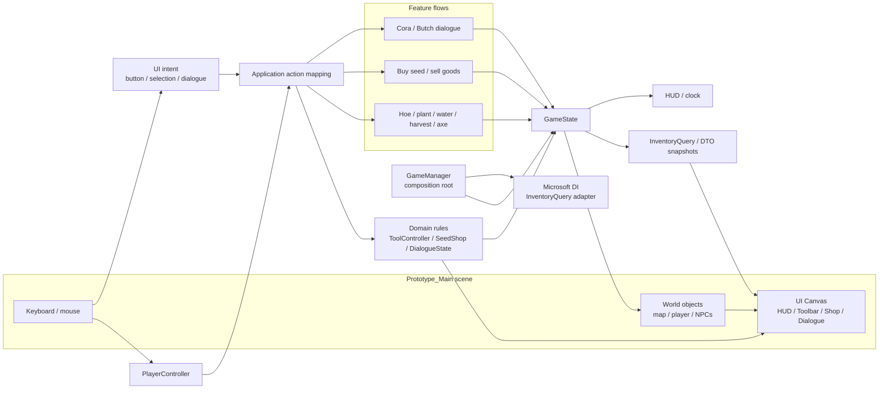
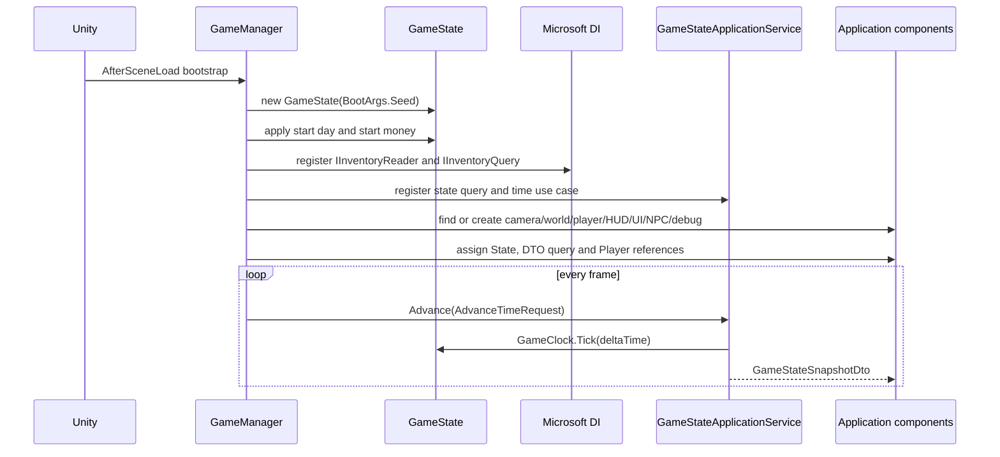
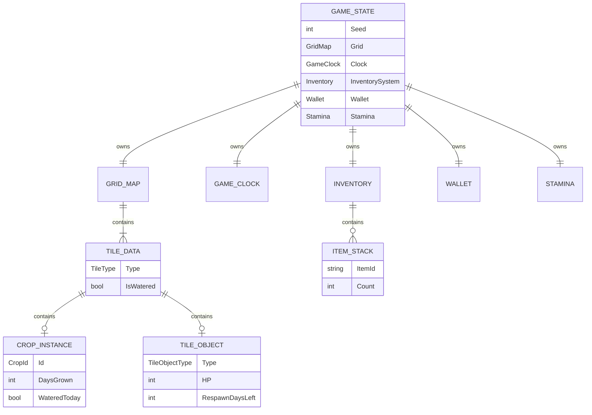
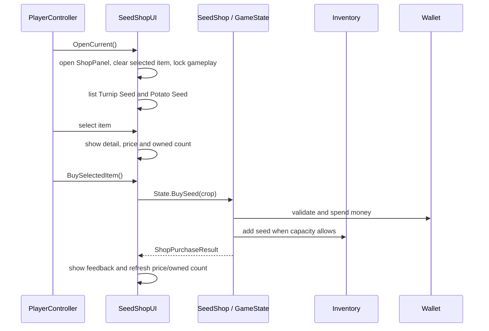

# Architecture flow — Farming Prototype

This document describes the current implementation in the `dev` branch. It is
not a target architecture: the flow below is based on the classes and scene
that actually exist in the project.

## 0. High-level runtime flow

The following diagram shows how input travels through the current Unity scene,
application components and domain state before the UI is refreshed.



Runtime ownership is intentionally explicit: the scene owns layout and art
references, Application owns input-to-view coordination, and Domain owns
state transitions and validation. UI never becomes the source of truth for
inventory, wallet, crops or time.

## 1. Current layer map

```text
Unity scene / Unity lifecycle
        │
        ▼
Prototype.Application
  GameManager          composition root and runtime bootstrap
  GameStateApplicationService
                       DTO mapping and time use case boundary
  PlayerController     input, movement, active-slot actions
  WorldView            world rendering
  HUD                 HUD rendering
  ToolbarCanvasUI      scene-authored toolbar binding
  InventoryScreenUI    inventory presentation
  SeedShopUI           UGUI shop and shop actions
  NpcDialogueController NPC interaction and dialogue presentation
  DebugPanel           debug-only controls
        │
        │ calls directly
        ▼
Prototype.Domain
  Entities/      GameState, GridMap, TileData, CropInstance,
                 Inventory, Wallet, Stamina, GameClock, NPC state
  ValueObjects/  GridCoord, ItemStack, tool result/value types
  Services/      ToolController, SeedShop
  Policies/      BalanceConfig, crop/tree definitions
  Ports/         IGameStateRepository, IInventoryReader
        │
        ▼
Prototype.Application adapters
  InventoryQuery / DTOs / use cases
  ArtCatalog / PlaceholderArt
  SessionLogger

Prototype.Infrastructure implementations
  InMemoryGameStateRepository
  Unity art and telemetry adapters
```

`Presentation` has been merged into `Application`. All runtime and UI code now
uses `Prototype.Application`; domain rules use `Prototype.Domain`. There is no
`Farm.Prototype.*` namespace in the current source.

The physical folders under `Assets/_Prototype/Scripts/Application/` are only
for navigation (`UI`, `Player`, `NPC`, `World`, `Debug`, etc.). They are not
separate architectural layers.

## 2. Composition and startup flow



`GameManager` is the actual composition root. It creates the domain state,
builds the Microsoft DI service provider, then wires the MonoBehaviours. The
shared time/read boundary is `GameStateApplicationService`; feature-specific
controllers still call the domain action methods directly until those use
cases need their own application services.

Infrastructure does not duplicate Domain entity logic. It implements Domain
ports such as `IGameStateRepository`; the in-memory adapter currently creates
and holds the aggregate, while a file/cloud adapter can replace it later.

Important bootstrap behavior:

- `Prototype_Main.unity` contains the main camera and authored UI canvas roots.
- `ToolbarCanvasUI` is found in the scene and bound to `Player` and
  `IInventoryQuery`; the toolbar is not created by `GameManager`.
- `GameStateApplicationService` maps mutable domain state into
  `GameStateSnapshotDto`. HUD time rendering consumes `IGameStateQuery` and
  does not read `GameClock` or create fallback IMGUI controls.
- Missing runtime components such as `PlayerController`, `HUD`,
  `InventoryScreenUI`, `SeedShopUI`, NPC and debug components are created by
  `GameManager` when absent.
- World and scenery are created/bound at runtime from `GameState` and
  `ArtCatalog`.

## 3. Domain state ownership



`GameState` is the shared state boundary used by runtime, tests and the
headless simulation. `ToolController` and `SeedShop` are plain domain rules;
they return structured results instead of updating UI.

## 4. Player action flow

```text
Keyboard / mouse
      ↓
PlayerController.Update()
      ↓
read active Inventory slot
      ↓
resolve item to action
      ├─ Hoe / WateringCan / Harvest / Axe → GameState.UseTool()
      ├─ Turnip/Potato seed                → GameState.PlantSpecific()
      └─ interaction tile                  → SeedShopUI.OpenCurrent()
      ↓
ToolController validates tile, stamina, inventory and object state
      ↓
GameState mutates Grid / Inventory / Wallet / Stamina
      ↓
PlayerController and UI components redraw from current state
```

Tree collision and the cursor use the same `GridMap.IsOccupied()` query. A
felled tree remains an occupied tile until its respawn countdown completes.

## 5. Seed shop flow



`SeedShopUI` is a UGUI component. It currently ensures the shop controls under
the scene-authored `ShopPanel` at runtime (`TitleText`, `ItemListPanel`,
`DetailPanel`, `PurchasePanel`, `BuyButton`, and `CloseButton`). Its public
Inspector-callable entry points are:

- `ListItems`, `ListItem(string)`
- `ListTurnipSeed`, `ListPotatoSeed`
- `ShowItemDetail(string)`, `ShowTurnipSeedDetail`, `ShowPotatoSeedDetail`
- `BuySelectedItem`, `BuyTurnipItem`, `BuyPotatoItem`

The domain transaction is atomic with respect to insufficient funds and full
inventory: it validates before changing wallet or inventory.

## 6. Toolbar, HUD and inventory flow

```text
GameState.InventorySystem
        │
        ├─ GameStateApplicationService → GameStateSnapshotDto
        │                              ├─ GameClockDto → HUD
        │                              └─ InventorySnapshot / InventorySlotData
        │                                  → ToolbarCanvasUI
        │
        ├─ direct state read → HUD / InventoryScreenUI
        │
        └─ active slot → PlayerController action resolution
```

The toolbar background, slot objects, anchors and responsive canvas are
scene-authored. Runtime code updates item images, counts and selection state.
`InventoryQuery` exists as the read-side adapter registered by DI; the domain
inventory remains the source of truth.

## 7. NPC dialogue flow

```text
Player near Cora/Butch
        ↓ E
NpcDialogueController finds nearby NpcDefinition
        ↓
DialogueState opens at line 0
        ↓ E / Enter / Space
advance line or close at final line
        ↓ Esc
close early and unlock gameplay
```

NPC definitions and dialogue state live in `Prototype.Domain`. The controller
owns proximity, input and presentation. There are no quests, branching choices,
relationship values or schedules in the current implementation.

## 8. Art and infrastructure flow

```text
Source sprites
      ↓ Editor CIArt / ArtCatalog
Resources/ArtCatalog.asset
      ↓
PlaceholderArt
      ├─ WorldView / scenery SpriteRenderers
      ├─ PlayerController player art
      └─ Toolbar/UI item icons

GameState / actions
      ↓
SessionLogger → local Artifacts/session_<seed>.csv
```

`ArtCatalog` and `SessionLogger` are currently in the `Prototype.Application`
namespace even though their folders identify them as infrastructure adapters.
They are not domain rules.

## 9. Testing and current boundary

- EditMode tests exercise domain rules, economy, crops, tools, clock, NPC state
  and DTO/query behavior without a scene.
- PlayMode tests boot the real scene and cover component wiring, collision,
  player-facing behavior and UI smoke paths.
- `HeadlessSim` runs the same `GameState`/domain rules for economy checks.
- Unity CLI is used for compile/test/build validation.

The current implementation is a pragmatic layered architecture, not a fully
separated MVC/CQRS application. UI MonoBehaviours still contain some controller
logic and call `GameState` directly. New features should keep rules in Domain,
put UI intent/state mapping in Application, and leave layout/art references in
the scene or art catalog.
