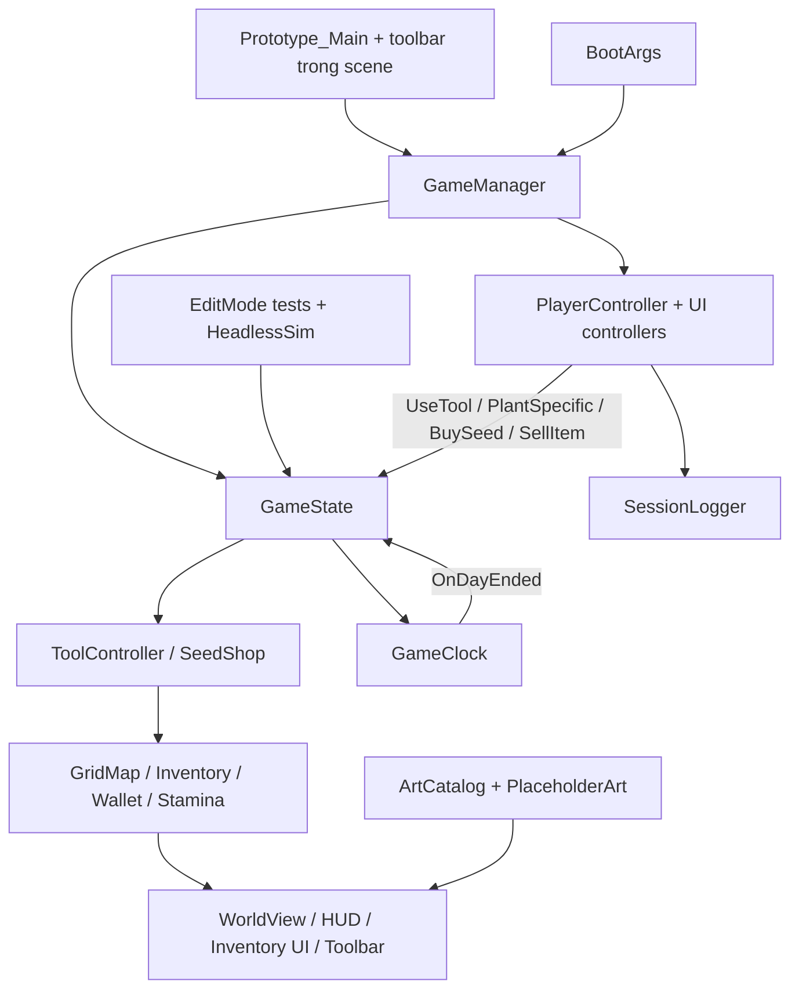
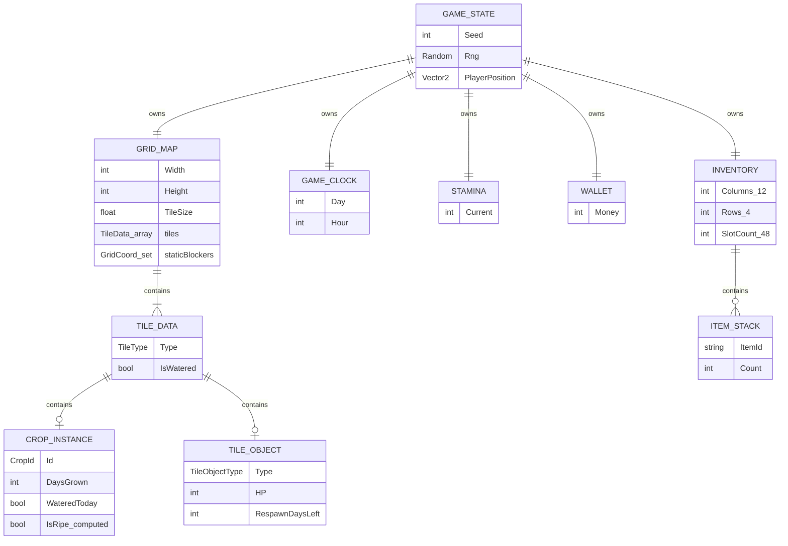
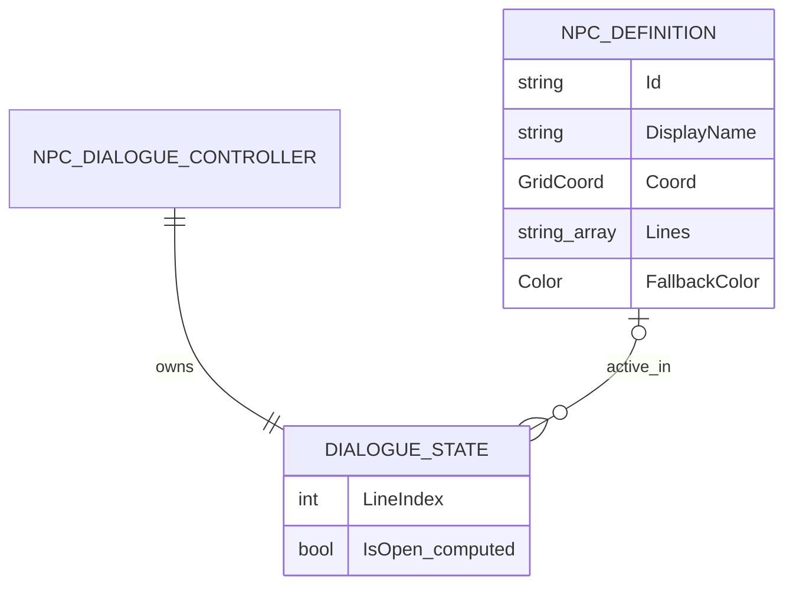
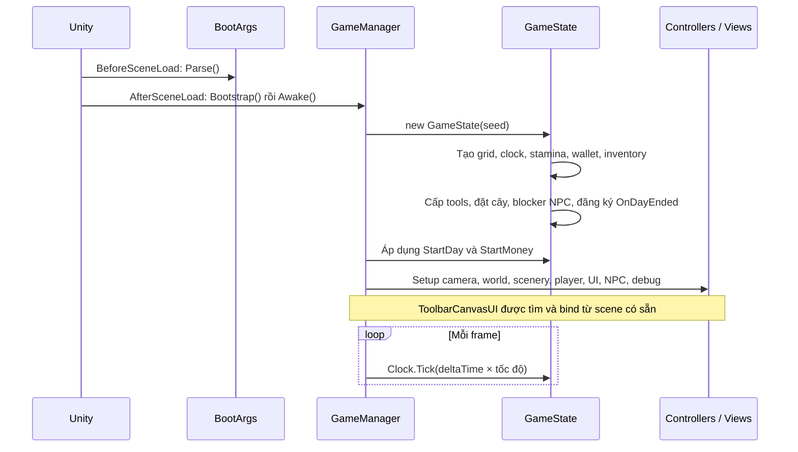
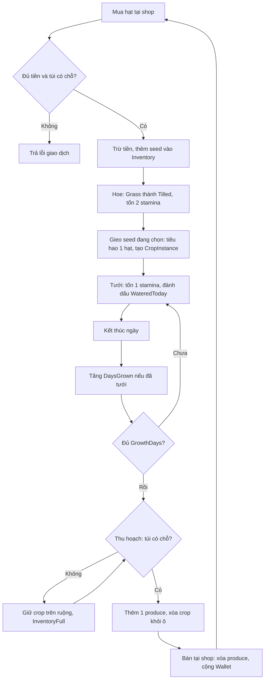
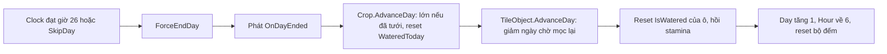

# Farming Prototype — Hướng dẫn phát triển

Tài liệu mô tả mã nguồn hiện có, đối chiếu ngày 10/09/2026. Phạm vi: gameplay, dữ liệu, kiến trúc, luồng xử lý và cách chạy/test/build.

## 1. Dự án làm gì?

Đây là prototype game nông trại 2D góc nhìn từ trên xuống bằng Unity/C#. Người chơi quản lý tiền, stamina và thời gian để phát triển ruộng trên bản đồ mặc định 20 × 20 ô.

Vòng chơi chính: **mua hạt → cuốc đất → gieo → tưới qua nhiều ngày → thu hoạch vào túi → bán nông sản → mua hạt tiếp**. Hoạt động phụ là chặt cây lấy gỗ để bán; cây mọc lại sau một số ngày. Hai NPC tĩnh, Cora và Butch, cung cấp hội thoại tuyến tính.

Phạm vi đã có trong code:

- Hai loại cây trồng: Turnip và Potato.
- Bốn công cụ khởi đầu: Hoe, WateringCan, Harvest, Axe; người chơi cần mua hạt.
- Inventory 48 ô (12 cột × 4 hàng), stack theo item ID, đổi vị trí ô và chọn đồ qua hotbar.
- Đồng hồ ngày, stamina, cửa hàng mua hạt/bán nông sản và gỗ.
- Hiển thị thế giới bằng sprite, UI túi đồ/cửa hàng/HUD, hội thoại và bảng debug.
- Mô phỏng kinh tế không cần scene, test EditMode/PlayMode và build qua CLI.

Trong mã gameplay được kiểm tra chưa có save/load, database, backend hay đồng bộ multiplayer. Các package Ads/IAP/Analytics/Multiplayer có trong manifest không đồng nghĩa các tính năng này đã được tích hợp vào vòng chơi.

## 2. Stack và bản đồ mã nguồn

Unity được ghim ở **6000.4.0f1** trong `ProjectSettings/ProjectVersion.txt`. Dependency khai báo tại `Packages/manifest.json`, gồm Unity Test Framework 1.6.0, uGUI 2.0.0, Input System 1.19.0 và Cinemachine 2.10.6. Input nhân vật hiện vẫn đọc qua `UnityEngine.Input`.

| Thư mục/file | Vai trò |
| --- | --- |
| `Assets/_Prototype/Scenes/Prototype_Main.unity` | Scene chạy chính, chứa UI toolbar được dựng sẵn |
| `Assets/_Prototype/Scripts/Core/` | GameState, bootstrap, clock, balance và các UI chính |
| `Assets/_Prototype/Scripts/Grid/` | Lưới, tọa độ, dữ liệu ô, vật thể và WorldView |
| `Assets/_Prototype/Scripts/Farming/` | Quy tắc công cụ, cây trồng, cây lấy gỗ |
| `Assets/_Prototype/Scripts/Inventory/` | Inventory và ItemStack |
| `Assets/_Prototype/Scripts/Economy/` | Wallet, giao dịch cửa hàng và kiểu kết quả |
| `Assets/_Prototype/Scripts/Player/` | Input, di chuyển, chọn ô/công cụ, stamina |
| `Assets/_Prototype/Scripts/NPC/` | Định nghĩa NPC, trạng thái và UI hội thoại |
| `Assets/_Prototype/Scripts/Debug/` | BootArgs, debug panel, catalog art, CSV logger |
| `Assets/_Prototype/Scripts/Sim/HeadlessSim.cs` | Mô phỏng nhiều ngày để kiểm tra kinh tế |
| `Assets/_Prototype/Resources/` | Asset được load khi chạy, gồm ArtCatalog |
| `Assets/_Prototype/Editor/` | Entry point compile/build/sim/art và setup toolbar |
| `Assets/Tests/EditMode/`, `Assets/Tests/PlayMode/` | Test logic và test runtime/UI |
| `tools/`, `Makefile` | Wrapper gọi Unity từ terminal |
| `Artifacts/` | Build, kết quả test, log và CSV mô phỏng |

`Library/`, `Logs/`, `UserSettings/` và các `.csproj` do Unity sinh không phải nơi sửa gameplay.

## 3. Kiến trúc

Thiết kế tách **state/rule không kế thừa MonoBehaviour** khỏi **controller/view chạy trong Unity**. `GameState` giữ trạng thái phiên chơi và cung cấp các thao tác cấp cao; runtime, test và simulator cùng sử dụng lớp này. Core vẫn dùng một số kiểu Unity như `Vector2`, `Vector3`, `Mathf`, nên chưa phải thư viện C# độc lập khỏi Unity.



Vai trò quan trọng:

- `GameManager`: singleton MonoBehaviour, tự bootstrap sau khi load scene, tạo state và nối các component runtime; gọi `Clock.Tick()` mỗi frame.
- `GameState`: sở hữu grid, clock, inventory, wallet, stamina, RNG và vị trí người chơi; khởi tạo công cụ/cây/blocker NPC, xử lý đổi ngày và bán đồ.
- `ToolController`: kiểm tra điều kiện, thay đổi state và trả `ToolResult`. Không render hay đọc input.
- `SeedShop`: kiểm tra tiền/sức chứa túi trước khi mua; trả kết quả có số tiền và số lượng trước/sau.
- `PlayerController` và UI: nhận input, gọi logic, phản hồi hình ảnh và log. Đây không chỉ là các view đọc dữ liệu.
- `WorldView`: biểu diễn trạng thái ô đất, cây trồng và vật thể thành sprite.
- `DialogueState`: state machine hội thoại riêng, do `NpcDialogueController` quản lý; không nằm trong `GameState`.

Assembly runtime là `Farm.Prototype`; `Farm.Prototype.Editor` chỉ chạy trong Editor. Test tách thành `Farm.Tests.EditMode` và `Farm.Tests.PlayMode`.

## 4. ERD — quan hệ dữ liệu trong bộ nhớ

Đây là **ERD logic của object runtime**, không phải schema SQL. Các quan hệ thể hiện ownership/reference. Tọa độ ô là chỉ số trong mảng `TileData[,]`; inventory dùng chỉ số trong `ItemStack[]`, không có bảng slot riêng.



Mỗi ô inventory chứa tối đa một stack hoặc `null`; toàn bộ túi chứa tối đa 48 stack. Một ô đất có tối đa một crop và một object theo cấu trúc dữ liệu, nhưng luật cuốc/gieo ngăn trồng trên ô có cây/gốc cây.

`CropDefinition` và `TreeDefinition` là các định nghĩa tĩnh tra cứu giá, thời gian lớn và item ID từ `BalanceConfig`, không phải entity được lưu trong database. `CropInstance.Id` là loại cây, không phải ID duy nhất của từng cây. `ItemStack.ItemId` liên kết theo chuỗi quy ước của seed/produce/tool/wood; chưa có một item database tổng quát.

ERD hội thoại tách riêng vì có vòng đời khác trạng thái ruộng:



`ActiveNpc == null` nghĩa là đóng hội thoại. `NpcDefinitions.All` cung cấp hai NPC tĩnh; `GameState` đưa tọa độ của họ vào `GridMap.staticBlockers`. NPC không dùng `TileObject` để tránh bị xử lý như cây chặt được.

## 5. Flow xử lý

ERD phía trên giải thích dữ liệu liên quan thế nào; các sơ đồ dưới đây bổ sung thứ tự thực thi.

### 5.1 Khởi động



Không nên suy từ bootstrap rằng scene rỗng sẽ có đầy đủ giao diện: `SetupToolbar()` chỉ tìm `ToolbarCanvasUI` hiện có và gán `Player`, không tự tạo toolbar.

### 5.2 Trồng trọt và kinh tế



Đường gọi khi dùng đồ: `PlayerController.UseTool()` → lấy ô trước mặt → nếu là ô shop thì mở shop → nếu không, đọc item ở `ActiveSlot` → `ResolveAction()` → `GameState.UseTool()` hoặc `PlantSpecific()` → `ToolController` → phản hồi `ToolResult`, hiệu ứng và CSV log.

Các quy tắc cần giữ khi phát triển:

- Hotbar chọn seed cụ thể dùng `PlantSpecific()`. Đường `ToolType.Seed` tổng quát ưu tiên Turnip khi có cả hai loại hạt.
- Chỉ cây có `WateredToday == true` mới tăng trưởng lúc hết ngày. Không tưới thì ngừng lớn, không tự chết.
- Tưới lại ô đã tưới trả thành công nhưng không trừ thêm stamina. Nên gieo trước rồi tưới: gieo hiện không sao chép `TileData.IsWatered` sang crop mới.
- Thu hoạch không cộng tiền trực tiếp; bán đồ qua `GameState.SellItem()` mới tăng tiền.
- Va chạm phân biệt `IsWalkable()` (địa hình) và `IsOccupied()` (cây/gốc cây/blocker NPC).

### 5.3 Đổi ngày và chặt cây



Chặt cây: dùng Axe → kiểm tra cây còn sống và stamina → trừ 4 stamina, giảm 1 HP → HP về 0 thì thêm 5 gỗ vào túi, đặt `RespawnDaysLeft = 4` → qua 4 lần đổi ngày cây hồi HP. Gốc cây vẫn chiếm ô, ngăn di chuyển/cuốc/gieo. Bán gỗ dùng cùng đường `SellItem()` như nông sản.

### 5.4 Hội thoại

Đứng trong bán kính 1,25 ô của NPC rồi nhấn `E` → `DialogueState.Open(npc)` tại dòng 0 → `E`/Enter/Space chuyển dòng → thao tác ở dòng cuối đóng hội thoại; `Esc` đóng sớm. Chưa có lựa chọn phân nhánh, quest hoặc lịch di chuyển NPC.

## 6. Thông số gameplay hiện tại

Nguồn: `Assets/_Prototype/Scripts/Core/BalanceConfig.cs`.

| Thông số | Giá trị |
| --- | --- |
| Tiền / stamina khởi đầu | 500 / 100 |
| Tốc độ di chuyển | 4 ô/giây |
| Thời gian | 40 giây thực/giờ game; 06:00 đến 02:00 hôm sau, khoảng 800 giây/ngày |
| Turnip | Hạt 20; bán 60; cần 4 ngày được tưới |
| Potato | Hạt 50; bán 160; cần 6 ngày được tưới |
| Cuốc / tưới / thu hoạch | 2 / 1 / 0 stamina |
| Cây lấy gỗ | 8 cây ban đầu trên map mặc định; 3 HP; 4 stamina/nhát |
| Gỗ | 5 đơn vị/cây; bán 8/đơn vị; cây mọc lại sau 4 ngày |

## 7. Chạy local, test và build

### Chạy trong Editor

1. Cài Unity **6000.4.0f1** qua Unity Hub và module của platform muốn build.
2. Mở thư mục dự án, chờ Unity resolve package và import asset. Dependency Git trong manifest cần Git và truy cập mạng khi chưa có cache.
3. Mở `Assets/_Prototype/Scenes/Prototype_Main.unity`, nhấn Play.
4. Di chuyển bằng WASD/phím mũi tên; dùng đồ bằng Space/Enter/click trái trong world. Đứng hướng về biển shop rồi dùng tương tác để mở mua/bán. `I` mở túi, `F1` mở debug, `E` nói chuyện NPC.

### CLI

Chạy từ thư mục gốc bằng Git Bash trên Windows. Wrapper tìm Unity theo đường dẫn chuẩn Unity Hub trong `tools/unity.sh`.

```bash
bash tools/make.sh compile
bash tools/make.sh test-edit
bash tools/make.sh test-play
bash tools/make.sh build-win BUILD=local
bash tools/make.sh sim
bash tools/make.sh gate
```

Nếu có GNU Make, có thể dùng `make compile`, `make test-edit`, `make test-play`, `make build-win`, `make sim`, `make gate`. `test` chỉ chạy EditMode; `gate` gồm compile → EditMode → PlayMode → Win64 build. Đóng Editor đang mở cùng project trước khi chạy Unity batch trên project đó.

Build Windows nằm ở `Artifacts/Build/Win/Farm.exe`. Ví dụ chạy từ PowerShell:

```powershell
& .\Artifacts\Build\Win\Farm.exe -seed 42 -startDay 1 -startMoney 500
# Đặt -fastTime trước một tham số có giá trị để parser hiện tại nhận được flag:
& .\Artifacts\Build\Win\Farm.exe -fastTime -seed 42 -startMoney 3000
```

`-fastTime` tăng clock 10 lần. Seed mặc định là 0; nên truyền seed cố định khi tái hiện lỗi. Cây gameplay được đặt theo dải cố định; cảnh trang trí dùng RNG theo seed.

`CIBuild` truyền scene chính trực tiếp vào `BuildPlayerOptions`. `ProjectSettings/EditorBuildSettings.asset` hiện có danh sách scene rỗng; nếu build qua UI Editor cần cấu hình scene tương ứng. Build CLI hiện là Development Build có AllowDebugging. WebGL có entry point riêng nhưng cần module WebGL được cài.

### Test và bằng chứng

| Nhóm | Nội dung kiểm tra trong source | Output CLI |
| --- | --- | --- |
| EditMode | Clock, crop, tools, state, shop, NPC dialogue, balance, art và logic layout | `Artifacts/editmode.xml`, `editmode.log` |
| PlayMode | Boot, collision, hướng nhân vật, input focus, UI smoke và snapshot/layout | `Artifacts/playmode.xml`, `playmode.log` |
| Economy sim | Dùng GameState để chạy nhiều ngày, thu hoạch/chặt/gieo/tưới/bán | `Artifacts/economy.csv` |
| Phiên chơi | Thao tác công cụ và giao dịch cửa hàng | `Artifacts/session_<seed>.csv`, `shop_<seed>.csv` |

`HeadlessSim` không mô phỏng di chuyển/thời gian đi lại; bước mua hạt của sim trực tiếp trừ wallet và thêm seed thay vì gọi `SeedShop.BuySeed()`. Vì vậy sim hữu ích cho balance nhưng không thay thế test UI/giao dịch. CSV là log theo dõi, không phải save game hay cơ chế replay tự động.

## 8. Điểm cần biết trước khi sửa

- Một số comment và README cũ đã lệch hành vi thực tế: inventory hiện là 48 ô; harvest đưa produce vào túi; toolbar hiện bind từ scene. Ưu tiên implementation và test hiện có khi đối chiếu.
- `ToolController.Chop()` chưa kiểm tra kết quả `Inventory.Add()` lúc cây đổ: túi đầy mà chưa có stack gỗ có thể làm mất phần gỗ nhận được. Harvest đã có kiểm tra `CanAdd()`.
- `Inventory.TryRemove()` yêu cầu đủ lượng trong một stack, trong khi `Count()` cộng tất cả stack cùng ID. Cần lưu ý nếu mở rộng cách chia stack hoặc import dữ liệu.
- Parser native trong `BootArgs` duyệt đến phần tử áp chót, nên `-fastTime` ở cuối dòng lệnh có thể bị bỏ qua.
- Khi thêm crop/item mới, rà cả định nghĩa, `PlayerController.ResolveAction()`, shop UI, art mapping, các hàm bán theo loại và simulator; hiện có nhiều nhánh dành riêng Turnip/Potato.
- Khi đổi gameplay rule, đặt logic trong state/controller dùng chung và bổ sung EditMode test tương ứng. Thay đổi input/scene/UI cần kiểm tra PlayMode và chạy scene thật.

Tài liệu này được kiểm tra bằng cách đọc mã nguồn và cấu hình; không khẳng định build/test hiện tại đã pass. Các điểm cần biết ở trên là nhận xét từ code, chưa phải kết quả tái hiện trong phiên chơi.
